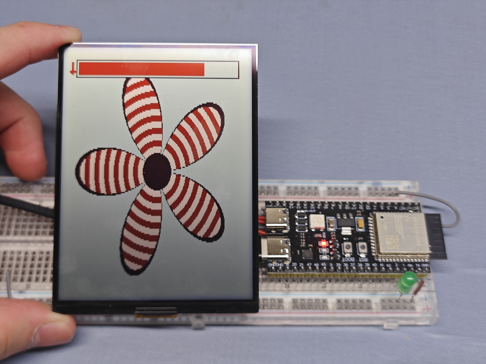

# Osptek 4.2" BWR TFT Driver for ESP32-S3 (ST7306)

# Osptek 4.2寸 BWR 三色反射屏驱动 (ST7306)

This project provides a custom driver and demonstration for the Osptek 4.2-inch Black/White/Red reflective TFT display (Controller: ST7306), optimized for the ESP32-S3.

本项目提供适用于 Osptek 4.2英寸黑白红三色反射式 TFT 屏幕（主控：ST7306）的自定义驱动与演示代码，针对 ESP32-S3 进行了优化。

## Background / 背景

Unlike standard TFTs, this reflective screen requires specific voltage settings and a unique pixel mapping logic. Through reverse engineering, we identified a **4-bit Nibble Interleaved** mapping (controlling odd/even pixels via high/low nibbles) to correctly render Red, Black, and White colors.

与普通 TFT 不同，这款反射屏需要特定的电压设置和独特的像素映射逻辑。通过逆向工程，我们确定了其采用 **4位半字节交织 (4-bit Nibble Interleaved)** 的映射方式（高低半字节分别控制奇偶像素），从而实现了红、黑、白三色的正确显示。

## Features / 特性

* **Resolution**: 300 x 400 (Vertical Scan).
* **Color Support**: Black, White, Red, and Neutral (Off).
* **Performance**: Supports standard 1Hz (LPM) and experimental 16Hz (HPM) refresh rates.
* **Demo**: Generates a procedural flower pattern with a direction indicator to verify orientation and color mapping.
* **分辨率**: 300 x 400 (垂直扫描).
* **颜色支持**: 黑、白、红及中性色（断电色）。
* **性能**: 支持标准的 1Hz (低功耗模式) 及实验性的 16Hz (高性能模式) 刷新率。
* **演示**: 动态生成花朵图案及方向指示箭头，用于验证屏幕方向与颜色映射。

## Pin Configuration / 引脚配置 (ESP32-S3)

|Display Pin|ESP32-S3 GPIO|Function|
|-|-|-|
|**VCI**|3.3V|Power (Do not use 5V)|
|**GND**|GND|Ground|
|**SCLK**|12|SPI Clock|
|**SDI**|11|SPI MOSI|
|**CS**|10|Chip Select|
|**DC**|9|Data/Command|
|**RES**|4|Reset|
|**TE**|5|Tearing Effect (Optional)|
|**LED**|2|Status LED|

## License

MIT License

